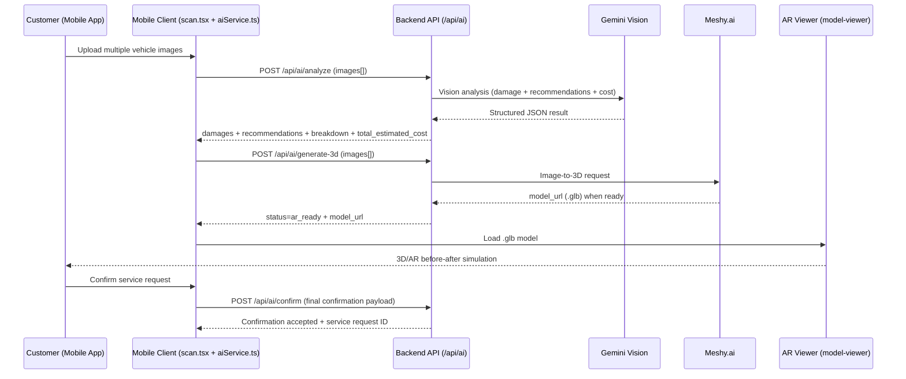

# AI Scan + AR + Cost Estimation Workflow (AutoSPF+)

## 1) Customer Journey (Product Flow)

1. **Scan Vehicle (Upload)**
   - Customer captures or uploads multiple vehicle images from different angles in the mobile app.
2. **AI Detects Defects**
   - System analyzes uploaded images and detects visible damage (e.g., scratches, dents, paint issues).
3. **System Identifies Problem Areas + Recommendations**
   - System highlights affected parts and suggests recommended repair/service actions.
4. **3D Vehicle Model Generation**
   - Uploaded images are sent to Meshy.ai to generate a `.glb` vehicle model.
5. **AR Repair Simulation (Before/After)**
   - Generated `.glb` is rendered with Google `model-viewer` for web 3D/AR visualization.
6. **Price & Service Cost Estimation**
   - System calculates total estimate using damage type, severity, and required service.
7. **Customer Confirms**
   - Customer reviews analysis, AR simulation, and estimate, then confirms service request.

---

## 2) Technical Sequence (Frontend → Backend → AI Services)

---

## 3) State Machine (Recommended)

Suggested state transitions for client orchestration:

- `idle`
- `validating`
- `damage_detected`
- `recommendations_ready`
- `3d_generation_triggered`
- `ar_ready`
- `cost_estimated`
- `awaiting_confirmation`
- `confirmed` | `cancelled`

This matches the current scan progression in mobile and keeps UI deterministic.

---

## 4) API Contract (Current + Needed)

### Existing in backend

- `POST /api/ai/analyze`
  - Input: `multipart/form-data` with `images[]`
  - Output: damage list, recommendations, cost breakdown, total cost
- `POST /api/ai/generate-3d`
  - Input: `multipart/form-data` with `images[]`
  - Output: `status`, `model_url`, message

### Needed to complete step 7

- `POST /api/ai/confirm` (to implement)
  - Purpose: persist customer confirmation and create service request/booking
  - Suggested payload:
    - `customerId`
    - `vehicleId`
    - `analysisResult` (damages/recommendations/cost)
    - `modelUrl`
    - `selectedServices`
    - `estimatedTotal`
  - Suggested response:
    - `success`
    - `serviceRequestId`
    - `status` (`confirmed`)

---

## 5) Repo Mapping (Where this flow lives now)

- Mobile scan UI + orchestration:
  - `mobile/src/app/(tabs)/scan.tsx`
  - `mobile/src/services/api/aiService.ts`
- Backend AI endpoints:
  - `backend/routes/aiRoutes.js`
  - `backend/controllers/aiController.js`
- Web AR renderer:
  - `autospf/src/components/ARCarViewer.tsx`

---

## 6) Implementation Notes

- `generate-3d` should be async job-based in production:
  - return `202 + taskId`
  - poll `GET /api/ai/generate-3d/:taskId` or use webhook/socket updates
- Add server-side validation for:
  - image count, MIME type, and file size
  - malformed AI payload fallback
- Persist full scan sessions for audit/history:
  - original uploads
  - AI results
  - model URL
  - final confirmation status

